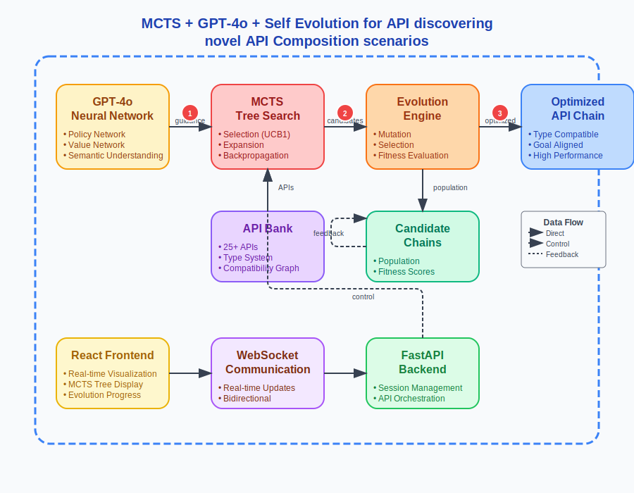

# MCTS (Monte Carlo Tree Search) + GPT-4o + Self Evolution for API discovering novel API Composition scenarios

An intelligent API composition system that uses **MCTS (Monte Carlo Tree Search) + GPT-4o + Self Evolution** to automatically discover and build novel API composition scenarios for business intelligence and data analysis tasks.



## 🚀 Features

- **GPT-4o Neural Guidance**: Uses GPT-4o as both policy and value network for intelligent API selection
- **MCTS Tree Search**: Systematically explores API composition space with UCB1 selection
- **Evolution Engine**: Optimizes API chains through mutation and selection
- **Real-time Visualization**: Professional React frontend with live MCTS tree and evolution progress
- **25+ API Bank**: Comprehensive set of APIs for data analysis, visualization, and reporting
- **Type Safety**: Automatic type compatibility checking and data flow validation
- **WebSocket Communication**: Real-time updates of composition progress

## 🏗️ Architecture

The system combines three powerful techniques:

1. **GPT-4o Neural Network**: Provides semantic understanding and intelligent guidance
2. **MCTS Tree Search**: Explores API composition space systematically
3. **Evolution Engine**: Optimizes the best candidates through genetic algorithms

### Key Components:

- **Backend**: FastAPI with WebSocket support
- **Frontend**: React with TypeScript, Tailwind CSS, and Framer Motion
- **AI Integration**: GPT-4o for policy and value networks
- **Visualization**: Real-time D3.js tree visualization and evolution progress

## 📋 Prerequisites

- Python 3.8+
- Node.js 16+
- OpenAI API key
- Git

## 🛠️ Installation

### 1. Clone the Repository
```bash
git clone <repository-url>
cd mcts-evolution-coding-agent
```

### 2. Backend Setup
```bash
# Create virtual environment
python3 -m venv venv
source venv/bin/activate  # On Windows: venv\Scripts\activate

# Install dependencies
pip install -r requirements_api.txt

# Set up environment variables
cp .env.template .env
# Edit .env and add your OPENAI_API_KEY
```

### 3. Frontend Setup
```bash
cd frontend
npm install
cd ..
```

## 🚀 Quick Start

### 1. Start the Backend
```bash
source venv/bin/activate
python api_composition_backend.py
```
The backend will start on `http://localhost:8000`

### 2. Start the Frontend
```bash
cd frontend
npm run dev
```
The frontend will start on `http://localhost:3000`

### 3. Open the Application
Navigate to `http://localhost:3000` in your browser.

## 🎯 Usage

1. **Configure Parameters**: Set MCTS iterations, evolution generations, and business objectives
2. **Start Composition**: Click "Start Composition" to begin the intelligent API chain building
3. **Watch Progress**: Observe real-time MCTS tree construction and evolution progress
4. **View Results**: See the optimized API chain with type compatibility and data flow

### Example Business Goals:
- Business Intelligence Dashboard
- Financial Risk Analysis  
- Market Research Report
- Competitive Analysis
- Investment Insights

## 🔧 Configuration

### MCTS Parameters:
- **Iterations**: Number of MCTS search iterations (5-30)
- **Exploration Constant**: UCB1 exploration parameter (0.5-2.0)
- **Target Task**: Business objective for API composition

### Evolution Parameters:
- **Generations**: Number of evolution generations (5-20)
- **Population Size**: Size of candidate population (10-50)
- **Mutation Rate**: Probability of mutations (0.1-1.0)

### GPT-4o Parameters:
- **Model**: gpt-4o or gpt-4o-mini
- **Temperature**: Creativity level (0.1-1.0)
- **Max Tokens**: Response length limit (100-2000)

## 📊 API Bank

The system includes 25+ APIs across 5 categories:

- **Data Sources**: News search, stock data, weather, company info
- **Analysis**: Sentiment analysis, trend analysis, entity extraction
- **Processing**: Text summarization, data filtering, normalization
- **Visualization**: Charts, heatmaps, timelines, plots
- **Output**: Reports, dashboards, alerts, presentations

## 🔬 How It Works

### 1. MCTS Phase
- **Selection**: Choose nodes using UCB1 + GPT-4o guidance
- **Expansion**: Add new APIs based on GPT-4o suggestions
- **Evaluation**: Score API chains using GPT-4o value network
- **Backpropagation**: Update node statistics

### 2. Evolution Phase
- **Population**: Initialize with best MCTS candidates
- **Mutation**: Modify API chains (add/remove/replace APIs)
- **Selection**: Choose fittest candidates for next generation
- **Optimization**: Converge to optimal API compositions

### 3. Real-time Visualization
- Live MCTS tree construction
- Evolution progress tracking
- API chain flow visualization
- Performance metrics dashboard

## 🛡️ Type Safety

The system ensures type compatibility through:
- **Type Compatibility Graph**: Maps valid type conversions
- **Automatic Validation**: Checks input/output type matching
- **Data Flow Analysis**: Ensures valid API chaining

## 🌐 WebSocket API

Real-time communication endpoints:
- `ws://localhost:8000/ws/{session_id}` - WebSocket connection
- Message types: `mcts_update`, `evolution_generation`, `system_status`

## 📁 Project Structure

```
├── api_composition_backend.py    # Main FastAPI backend
├── frontend/                     # React frontend
│   ├── src/
│   │   ├── components/          # React components
│   │   ├── hooks/               # Custom hooks
│   │   ├── store/               # Zustand state management
│   │   └── types/               # TypeScript definitions
├── architecture_diagram.svg     # System architecture
├── requirements_api.txt         # Python dependencies
└── README.md                    # This file
```

## 🤝 Contributing

1. Fork the repository
2. Create a feature branch (`git checkout -b feature/amazing-feature`)
3. Commit your changes (`git commit -m 'Add amazing feature'`)
4. Push to the branch (`git push origin feature/amazing-feature`)
5. Open a Pull Request

## 📄 License

This project is licensed under the MIT License - see the [LICENSE](LICENSE) file for details.

## 🙏 Acknowledgments

- OpenAI for GPT-4o API
- FastAPI for the excellent web framework
- React and the amazing frontend ecosystem
- D3.js for powerful visualizations

## 📞 Support

For questions and support, please open an issue on GitHub.

---

**Built with ❤️ using GPT-4o, MCTS, and Evolution**